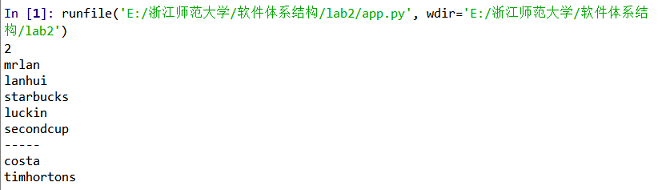
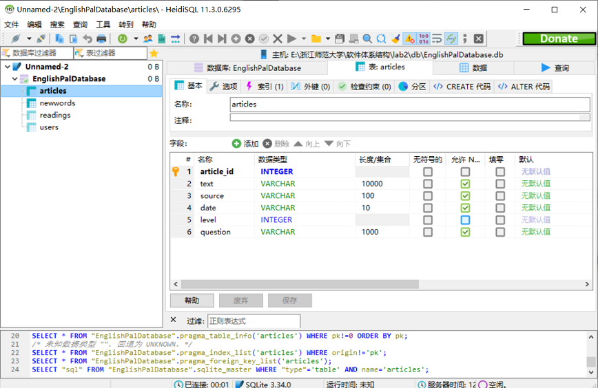
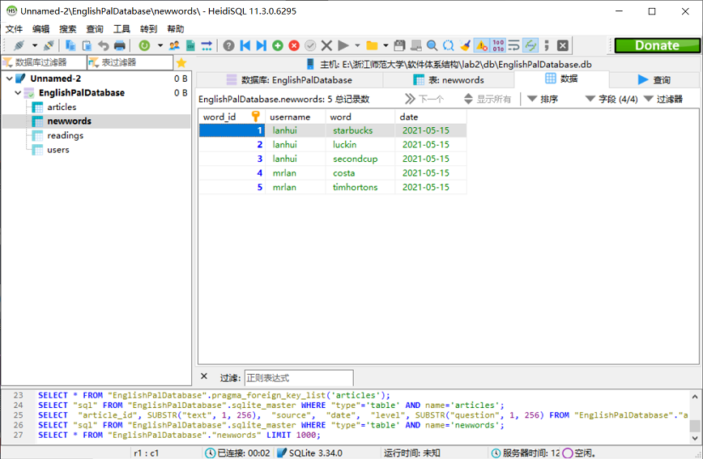
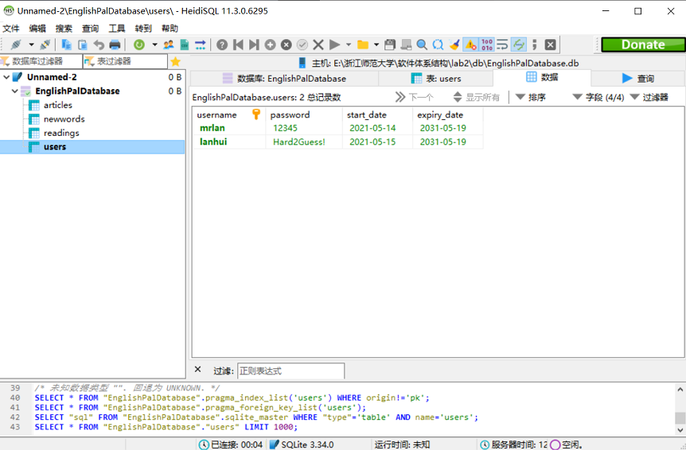

实验二： ORM关系映射
======================================
.. raw:: html

   

   作者：许璐怡 朱文琦 洪仪 诸斯涔

.. raw:: html

    

   来源：浙江师范大学

.. raw:: html

   &nbsp;&nbsp;&nbsp;&nbsp;

   日期：2021/05/31

.. raw:: html

   

摘要
------------------
为了避免把sql语句写死在代码里，我们需要一种能像面向对象那样直接把原生sql封装好了并且以你熟悉的方式操作的方法——ORM就是对象映射关系程序。相当于ORM帮我们SQL写成类的形式，然后通过类来调用，获取，而不是写底层的sql（insert，update，select）来获取。ORM 相当于把数据库也给实例化了，在代码操作mysql中级又加了orm这一层。使用SQLAlchemy的ORM（对象关系映射器）操作数据库，就不需要在web程序应用中编写任何原始SQL语句。

在该实验中，我们需要借助ORM和SQLAlchemy等工具为现有项目EnglishPal建立四个数据库表，来提高学习者的词汇量。学习如何运用SQLAlchemy将一个类映射到一个表里，将该类的一个数据映射到数据表中的一行，并客观分析其优缺点。

介绍
------------------
对象关系映射（Object Relation Mapping，简称ORM，或O/RM，或O/R mapping），是一种程序技术，用于实现面向对象编程语言里不同类型系统的数据之间的转换。从效果上说，它其实是创建了一个可在编程语言里使用的“虚拟对象数据库”。

面向对象是从软件工程基本原则（如耦合、聚合、封装）的基础上发展起来的，而关系数据库则是从数学理论发展而来的，两套理论存在显著的区别。为了解决这个不匹配的现象，对象关系映射技术应运而生。

对象关系映射（Object-Relational Mapping）提供了概念性的、易于理解的模型化数据的方法。ORM方法论基于三个核心原则： 简单：以最基本的形式建模数据。 传达性：数据库结构被任何人都能理解的语言文档化。 精确性：基于数据模型创建正确标准化的结构。 典型地，建模者通过收集来自那些熟悉应用程序但不熟练的数据建模者的人的信息开发信息模型。建模者必须能够用非技术企业专家可以理解的术语在概念层次上与数据结构进行通讯。建模者也必须能以简单的单元分析信息，对样本数据进行处理。ORM专门被设计为改进这种联系。

简单的说：ORM相当于中继数据。通过ORM将编程语言的对象模型和数据库的关系模型建立映射关系，这样我们在使用编程语言对数据库进行操作的时候可以直接使用编程语言的对象模型进行操作就可以了，而不用直接使用sql语言。

实验过程
------------------

实验工具
>>>>>>>>>>>>>>>>>>
ORM
::::::::::::::::::
ORM全称Object Relational Mapping对象关系映射。

ORM 将数据库中的表与面向对象语言中的类建立了一种对应关系。这样操作数据库或者数据库中的表或者表中的一条记录就可以直接通过操作类或者类的实例来完成。

SQLAlchemy
::::::::::::::::::
SQLAlchemy是一个常用的ORM工具，使用它可以快速方便的构建数据库模型。

.. raw:: html

   

.. image::  images/pic01.png

图一 SQLAlchemy框架

.. raw:: html

   

::

    组成部分：

    Engine，框架的引擎

    Connection Pooling ，数据库连接池

    Dialect，选择连接数据库的DB API种类

    Schema/Types，架构和类型

    SQL Expression Language，SQL表达式语言

    SQLAlchemy本身无法操作数据库，其必须以来pymsql等第三方插件，Dialect用于和数据API进行交流，根据配置文件的不同调用不同的数据库API，从而实现对数据库的操作。

实验方法
>>>>>>>>>>>>>>>>>>
首先要给python安装sqlalchemy、python-mysqldb两个包，在cmd控制台种进行pip install即可。如图二所示：

.. raw:: html

   

图二 pip install界面

.. raw:: html

   

安装成功后我们即可在python编辑器中对代码进行修改、运行和测试。如图三所示：

.. raw:: html

   

图三 python编辑器界面

.. raw:: html

   

对代码进行审阅和修改后，即可按要求成功生成标准数据库，同时编辑器中会输出在生成数据库过程中产生的测试结果，如图四所示：

.. raw:: html

   

图四 运行测试输出展示

.. raw:: html

   

实验结果
------------------

数据表的生成
>>>>>>>>>>>>>>>>>>

运用ORM成功生成四个数据表，如图五所示：

.. raw:: html

   

图五 成功生成数据表

.. raw:: html

   

以下图六至图十三分别为用修改代码成功生成的articles、newwords、readings和users表的结构和数据截图：

.. raw:: html

   

图六 articles表结构

.. raw:: html

   

.. raw:: html

   

图七 articles表数据

.. raw:: html

   

.. raw:: html

   

图八 newwords表结构

.. raw:: html

   

.. raw:: html

   

图九 newwords表数据

.. raw:: html

   

.. raw:: html

   

图十 readings表结构

.. raw:: html

   

.. raw:: html

   

图十一 readings表数据

.. raw:: html

   

.. raw:: html

   

图十二 users表结构

.. raw:: html

   

.. raw:: html

   

图十三 users表数据

.. raw:: html

   

代码修改
>>>>>>>>>>>>>>>>>>

model.py
::::::::::::::::::

read_article函数成功将用户名和文章id数据添加到readings表中，成功生成的readings表将通过ForeignKey与users表、articles表相关联，我们可以通过readings表成功追踪到每个用户的文章阅读记录。

model.py中User类里的read_article方法里的pass修改为self._read.append(article),将用户阅读过的文章添加到列表中，用于记录每个用户的阅读情况。

model.py修改代码处如图十四所示：

.. raw:: html

   

图十四 model.py修改代码处

.. raw:: html

   

orm.py
::::::::::::::::::

而为了实验ORM映射，我们针对orm.py代码文件的start_mappers函数进行了修改，并新添加了一个readings数据表结构。

（1）orm.py中添加readings表，主键为阅读id，随着输入数据条目增加自增。两个外键分别连接users表和articles表，调用username和article_id。

（2）orm.py中start_mappers方法中添加的代码，将article类映射到articles表里、将user类映射到users表里，由于newwords表和readings表里都有users表的外键，所以也将他们映射进来，因为readings表有两个外键，多对多关系会在两个类之间增加一个关联的表。这个关联的表在 relationship() 方法中通过 secondary 参数来表示。mapper函数进行映射后，app.py中通过query查询返回的结果，会自动将返回的结果构造成一个reading对象，并拥有id属性。

orm.py修改代码处如图十五所示：

.. raw:: html

   

图十五 model.py修改代码处

.. raw:: html

   

app.py
::::::::::::::::::

在app.py文件中，我们也只对数据库文件生成的路径进行了修改，如图十六所示：

.. raw:: html

   

图十六 app.py修改代码处

.. raw:: html

   

实验总结
------------------
ORM框架的作用就是把数据库表的一行记录与一个对象互相做转换，项目里面真正使用它的时候还需要进行合理的封装，它有优势也有缺陷。

**优势：**

它隐藏了数据访问细节，实现了以“封闭”的通用数据库交互为核心的映射。这使得我们的通用数据库交互变得简单易行，并且完全不用考虑令人厌烦的SQL语句，从而进行快速开发，因此，ORM使得我们构造固定的数据结构变得简单易行。

**缺陷：**

自动化意味着不可避免得映射和关联管理，这种工作的代价是牺牲性能（这也是早期所有不喜欢ORM人的共同点）。现在的各种ORM框架都在尝试使用各种方法来减轻这种负担。

实验代码
------------------

model.py
>>>>>>>>>>>>>>>>>>>>>>>>>>>>>>

::

    from dataclasses import dataclass

    @dataclass
    class Article:
        article_id:int
        text:str
        source:str
        date:str
        level:int
        question:str

    class NewWord:
        def __init__(self, username, word='', date='yyyy-mm-dd'):
            self.username = username
            self.word = word
            self.date = date

    class User:
        def __init__(self, username, password='12345', start_date='2021-05-19', expiry_date='2031-05-19'):
            self.username = username
            self.password = password
            self.start_date = start_date
            self.expiry_date = expiry_date
            self._read = []

        def read_article(self, article):
            self._read.append(article)

orm.py
>>>>>>>>>>>>>>>>>>>>>>>>>>>>>>

::

    from sqlalchemy import Table, MetaData, Column, Integer, String, Date, ForeignKey
    from sqlalchemy.orm import mapper, relationship

    import model

    metadata = MetaData()

    articles = Table(
        'articles',
        metadata,
        Column('article_id', Integer, primary_key=True, autoincrement=True),
        Column('text', String(10000)),
        Column('source', String(100)),
        Column('date', String(10)),
        Column('level', Integer, nullable=False),
        Column('question', String(1000)),
        )

    users = Table(
        'users',
        metadata,
        Column('username', String(100), primary_key=True),
        Column('password', String(64)),
        Column('start_date', String(10), nullable=False),
        Column('expiry_date', String(10), nullable=False),
        )

    newwords = Table(
        'newwords',
        metadata,
        Column('word_id', Integer, primary_key=True, autoincrement=True),
        Column('username', String(100), ForeignKey('users.username')),
        Column('word', String(20)),
        Column('date', String(10)),
        )

    readings = Table(
        'readings',
        metadata,
        Column('id', Integer, primary_key=True, autoincrement=True),
        Column('username', String(100), ForeignKey('users.username')),
        Column('article_id', Integer, ForeignKey('articles.article_id')),
        )

    def start_mappers():
        readings_mapper = mapper(model.Article, articles)
        mapper(model.User, users, properties={
            'newwords' : relationship(model.NewWord, backref='users'),
            "_read": relationship(
                readings_mapper, secondary=readings, collection_class=list
            )
        },)
    mapper(model.NewWord,newwords)

app.py
>>>>>>>>>>>>>>>>>>>>>>>>>>>>>>

::

    from sqlalchemy import create_engine
    from sqlalchemy.orm import sessionmaker

    import model
    import orm

    orm.start_mappers()
    engine = create_engine(r'sqlite:///E:\浙江师范大学\软件体系结构\lab2\db\EnglishPalDatabase.db')
    orm.metadata.drop_all(engine)
    orm.metadata.create_all(engine)
    get_session = sessionmaker(bind=engine)

    # add two users

    session = get_session()

    try:
        session.add(model.User(username='mrlan', password='12345', start_date='2021-05-14'))
        session.add(model.User(username='lanhui', password='Hard2Guess!', start_date='2021-05-15'))
        session.commit()
    except:
        print('Duplicate insertions.')

    print(session.query(model.User).count())

    for u in session.query(model.User).all():
        print(u.username)

    session.close()

    # add a few new words

    session = get_session()
    session.add(model.NewWord(username='lanhui', word='starbucks', date='2021-05-15'))
    session.add(model.NewWord(username='lanhui', word='luckin', date='2021-05-15'))
    session.add(model.NewWord(username='lanhui', word='secondcup', date='2021-05-15'))
    session.add(model.NewWord(username='mrlan',  word='costa', date='2021-05-15'))
    session.add(model.NewWord(username='mrlan',  word='timhortons', date='2021-05-15'))
    session.commit()
    session.close()

    # add a few articles

    session = get_session()
    article = model.Article(article_id=1, text='THE ORIGIN OF SPECIES BY MEANS OF NATURAL SELECTION, OR THE PRESERVATION OF FAVOURED RACES IN THE STRUGGLE FOR LIFE', source='CHARLES DARWIN, M.A.', date='1859-01-01', level=5, question='Are humans descended from monkeys?')
    session.add(article)
    session.commit()
    session.close()

    # query user and let him read something

    session = get_session()
    user = session.query(model.User).filter_by(username='lanhui').one()

    for item in list(user.newwords):
        print(item.word)

    user.read_article(article) # this method call will add a row to table readings

    print('-----')

    user = session.query(model.User).filter_by(username='mrlan').one()
    for item in list(user.newwords):
        print(item.word)

    user.read_article(article) # this method call will add a row to table readings

    session.commit()
    session.close()

参考资料
------------------
1. Harry Percival and Bob Gregory. Architecture Patterns with Python. O’Reilly Media; 1st edition (March 31, 2020)
2. SQLAlchemy使用笔记 https://blog.csdn.net/billvsme/article/details/50197197
3. Python SQLAlchemy表的ORM描述 https://blog.csdn.net/weixin_42072754/article/details/106732722

